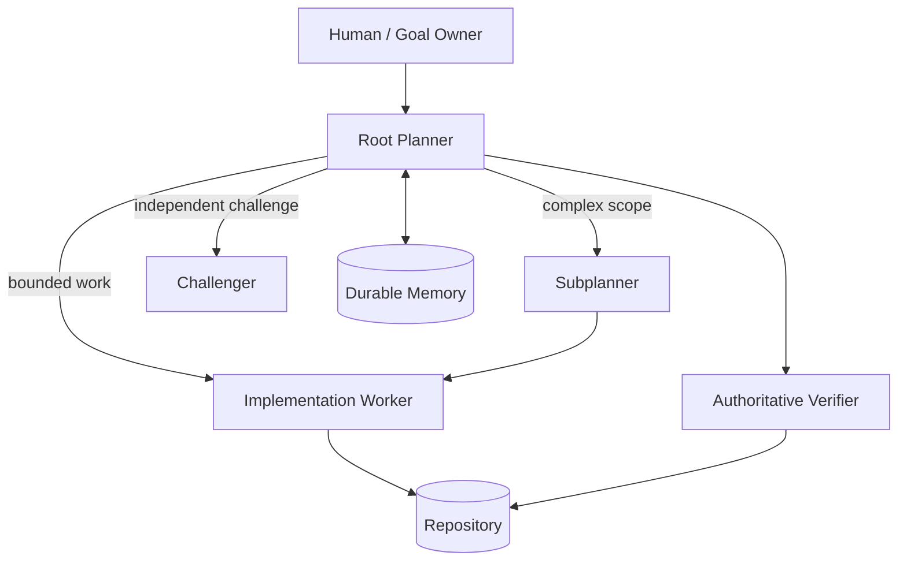
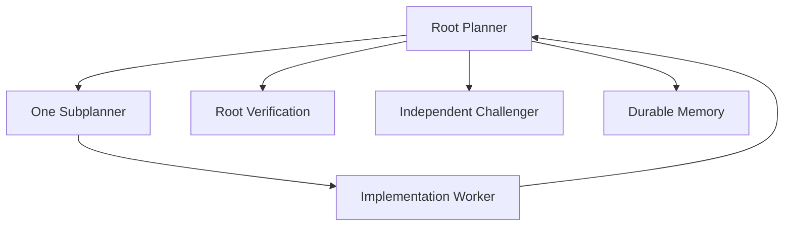

# Agentic Engineering Harness

[](LICENSE)

This repository is a working DSH (DeepSeek Harness) configuration for a hierarchical software-engineering agent: a root planner that owns the objective, a subplanner that decomposes bounded work, an implementation worker, an authoritative verifier, an independent challenger, and durable memory, each scoped down instead of one model holding every permission at once. It is validated end to end on Windows, and it is published so you can clone it, run it against a real repository, and change it.

> Planner decides. Worker implements. Verifier proves. Challenger attacks. Memory remembers.

I built this to find out whether splitting an engineering agent into separate roles, each with a narrower job and a harder boundary, actually beats pointing one strong model at a repository and letting it run. I work in adversarial simulation, detection engineering, and DFIR, and I wrote this on my own time because I wanted a setup I could reproduce and argue with, not a demo.

The role contracts in `presets/self-driving/agent.cordis.yml` are written to outlive DSH, Claude, and Engram. That's a design goal, not a proven property. I have not ported them to a second runtime yet, so I am not calling this project vendor-agnostic until a port actually holds up. See "Porting the architecture to another runtime" below for what your runtime would need to provide.

## What this is, and what it is not

This is not a claim that autonomous agents solve software engineering. One validated end-to-end run on one tiny task does not prove that. What this repository gives you is a reproducible way to ask harder questions and check the answers yourself:

- How should intent ownership be separated from implementation?
- When should a planner delegate instead of coding?
- How do you verify a worker's claims instead of trusting them?
- What belongs in persistent memory, and what has to stay transient?
- When is model diversity worth the extra cost and latency?
- How should agents degrade when a provider, quota, tool, or sandbox fails?
- How do you scale from one worker to parallel isolated workers without corrupting the repository?
- How do you evaluate orchestration quality, not just code generation quality?

These are open questions I do not have final answers to. The roadmap exists to turn each one into a falsifiable experiment.

## The architecture



The role names in this diagram are the part meant to survive. The tools that fill each role below will not.

**Root Planner.** Owns the user's objective, the global plan, delegation, integration decisions, final acceptance, and the durable memory lifecycle. It does not own routine implementation. If a root planner starts editing files directly, it has quietly become a worker with extra authority, and nothing left in the system checks its work.

**Subplanner.** Owns a bounded domain: local decomposition, worker instructions, and reporting upward. It does not own final acceptance, global memory, or cross-project authority. Remove this role on a large task and the root planner either drowns in low-level detail or starts skipping decomposition altogether.

**Worker.** Owns implementation of one bounded objective, whatever local checks it is permitted to run, and a concise report. It does not own final completion, durable memory, or orchestration policy. A worker that gets to declare its own task done has replaced verification with self-report.

**Verifier.** Owns authoritative acceptance checks: repository diff inspection, tests, build, lint, static analysis, and detection of unrelated changes. In this reference implementation the verifier role is root-level, not a separate agent, because the worker environment could not always run its own tests under an approval-gated shell (see the V0.1 findings below). If nothing plays this role, "done" means only "a worker said so."

**Challenger.** Owns independent criticism, requirement-gap detection, edge-case review, and alternative reasoning, and should not silently mutate the implementation it is reviewing. If the challenger shares an implementation path with the worker, model diversity buys you nothing; the second opinion just repeats the first opinion's blind spots.

**Durable Memory.** Owns decisions, stable conventions, non-obvious discoveries, reusable lessons, and session summaries. It does not own locks, worker status, transient todo state, or runtime scheduling. Let memory absorb coordination duties and it turns into a second, worse task queue that nobody audits.

## 2026 reference implementation

| Capability | Current implementation |
|---|---|
| Orchestration runtime | DeepSeek Harness (DSH) |
| Root planner | Claude Opus 5 |
| Subplanner | Claude Sonnet 5 |
| Primary implementation worker | Claude Code |
| Independent challenger / reviewer | Codex |
| Durable memory | Engram over MCP |
| Authoritative verification | Root-level Git / PowerShell / project test commands |
| Platform tested | Windows + PowerShell |

These are the adapters validated in V0.1, not a permanent commitment. The role contracts in `presets/self-driving/agent.cordis.yml` are the part meant to last; swap any row in this table and the contracts should still apply without a rewrite. That claim has not been tested against a second runtime, model, or memory provider. V0.1 validated one specific stack, not portability itself.

## Reading the role prompts

If you want to understand or adapt this project, start here instead of the architecture diagram. The diagram is the shape. `presets/self-driving/agent.cordis.yml` is where the shape becomes enforceable text, and it is the most useful file in the repository for that purpose.

### Root planner

The root planner's persona comes from the `persona` plugin's `prefix` field. It states its own authority directly:

```text
You own the user's original objective and maintain global understanding
of the project until the objective is complete.

Your primary responsibility is planning, decomposition, delegation,
integration reasoning, verification and durable project memory —
not routine implementation.

...

Do not perform routine implementation yourself with write, edit or
PowerShell. Delegate implementation to a worker.

...

Never blindly trust a worker result.

Evaluate the result against the original objective.

...

Never declare the objective complete merely because one worker reports
success.

Completion is your responsibility.
```

The same persona also makes the root planner the sole owner of the Engram memory lifecycle, and it is specific about the one mistake that would make memory routing unreliable across repositories:

```text
You are the ONLY agent responsible for Engram memory lifecycle.

...

Never hard-code an Engram project name.

Never infer the project from the MCP server process directory when the
active workspace directory is available.
```

That last line matters more than it looks. The MCP server is a long-lived process with its own working directory, which is not necessarily the repository you are sitting in. Project identity has to come from the active workspace at session start, not from wherever the memory server happens to be running.

### Subplanner

The subplanner's persona lives under the `persona` field of the `tool-subplanner` plugin. It is scoped down deliberately, with no path back to durable memory and no path to Codex:

```text
You own only the bounded objective delegated to you by your parent.

Do not directly implement code.

...

You do not have authority over durable project memory.

Do not start Engram sessions.

Do not save Engram memories.

Do not use Engram as a task queue, scratchpad, status mechanism,
lock manager or coordination channel.

Durable memory ownership belongs to the root planner.

You do not have access to Codex by policy.

Escalation to Codex belongs to the root planner.

...

Prefer the shallowest hierarchy capable of solving the problem.
```

### Structural enforcement versus prompt policy

The subplanner is not merely told to stay in its lane. The runtime removes the tools that would let it leave:

```yaml
        maxDepth: 2

        toolFilter:
          deny:
            - write
            - edit
            - pwsh
            - subagent_codex
```

`write`, `edit`, `pwsh`, and `subagent_codex` are not available to the subplanner regardless of what any prompt says, and `maxDepth: 2` caps how deep the planning recursion can go. That is a different kind of guarantee than a persona instruction. A prompt is a request a model can misread, deprioritize, or override under pressure. A `toolFilter.deny` entry is a request the runtime never routes.

The gap between the two shows up directly in the V0.1 eval. The task in `evals/001-e2e-safe-divide/` asked for exactly one implementation worker, in plain language, and the subplanner spawned a second one anyway to re-verify the first worker's output (see `evals/001-e2e-safe-divide/result.md`). Worker cardinality was never wired into `toolFilter` or `maxDepth`, only stated in a sentence, and the sentence did not hold. That is the honest reading: this preset structurally enforces role boundaries where it has a mechanism to do so, and still relies on prompt-level discipline for concurrency limits, which is exactly the invariant that failed.

### Worker and challenger

The implementation worker and the challenger are not personas at all. They are configuration:

```yaml
    - id: tool-subagent-claude-code
      name: '@deepseek-ai/dsh-tool-subagent'
      config:
        provider: claude-code
        toolName: subagent_claude_code
        backgroundMode: one-shot
        enableRunInBackground: false
        maxDepth: provider-managed

    - id: tool-subagent-codex
      name: '@deepseek-ai/dsh-tool-subagent'
      config:
        provider: codex
        toolName: subagent_codex
        backgroundMode: one-shot
        enableRunInBackground: false
        maxDepth: provider-managed
```

Both run `backgroundMode: one-shot`, and both delegate depth management to the provider rather than to a Cordis-level `maxDepth` number. The per-task instructions each of them receives are written fresh by whichever planner delegates to them, not baked into a persona. The root persona defines what those instructions must contain:

```text
Each delegated task must have:
- one clear objective;
- explicit scope and boundaries;
- relevant technical constraints;
- expected verification;
- and a clear completion condition.

Workers should return:
- what they changed;
- tests or checks performed;
- important discoveries;
- unresolved issues;
- and recommended follow-up work.
```

`one-shot` mode is also the reason the V0.1 run could not fully reconstruct lineage after the fact: completed one-shot children dropped out of the continuable-agent list once they finished, so run records had to stand in for what would otherwise be live agent state (`docs/dsh-windows-setup.md`, finding 3).

### Memory discipline

The root persona's save and never-save lists are the actual contract for what belongs in Engram:

```text
Good candidates include:
- architecture decisions;
- important configuration decisions;
- stable project conventions;
- non-obvious discoveries;
- completed bug fixes with reusable lessons;
- recurring failure modes;
- significant technical constraints;
- patterns that future sessions should follow.

Do NOT save:
- task progress;
- worker status;
- temporary hypotheses;
- logs;
- transient command output;
- implementation chatter;
- short-lived todo items;
- agent coordination state.
```

## Porting the architecture to another runtime

DSH is the runtime this architecture happens to be running on today. If you want the same role model on something else, LangGraph, a supervisor loop you wrote yourself, or whatever ships next year, your runtime needs to provide a specific set of properties. This is not a pitch for DSH. It is a checklist, derived from what `presets/self-driving/agent.cordis.yml` actually relies on, that you can hold your own runtime against.

| Property the runtime must provide | How DSH provides it today |
|---|---|
| A root role that owns the objective and is the only role permitted to accept completion | The root persona states this directly (quoted above, under "Root planner"). No other role in the preset has a path to the user-facing session: a subplanner and a worker both report to whoever called them, not to the human. |
| A way to hand a worker a bounded task and get back a structured report, without letting the worker declare the overall job done | The root and subplanner personas define what a delegated task and a returned report must contain (see "Worker and challenger" above). `subagent_claude_code` and `subagent_codex` return their output to the caller as a tool result; DSH gives neither one a separate path to end the session. |
| Per-role tool permissions enforced by the runtime, not merely requested in a prompt | The subplanner's `toolFilter.deny` list (quoted above, under "Structural enforcement versus prompt policy") removes `write`, `edit`, `pwsh`, and `subagent_codex`, and `maxDepth: 2` caps recursion. Cordis enforces both regardless of what the subplanner's own persona says. Worker cardinality shows what happens without that enforcement: the V0.1 task needed exactly one implementation worker, that limit was never added to `toolFilter` or `maxDepth`, only written into a sentence, and the subplanner spawned a second worker anyway. That gap is the reason this property belongs on the runtime, not in a prompt. |
| A durable knowledge store kept separate from the runtime's own coordination state, with project identity established explicitly from the active workspace rather than inferred from the memory process's working directory | Engram runs as its own long-lived MCP process, outside Cordis's session state. The repository DSH happens to be sitting in is not necessarily the directory that process started from, so the root persona calls `mem_session_start` with `directory` set explicitly to the workspace `cwd` and treats the project Engram returns as authoritative for the session. |
| A trace or run record sufficient to reconstruct which agents participated, after the run is over | Both `subagent_claude_code` and `subagent_codex` run with `backgroundMode: one-shot`; DSH stops listing a one-shot child in the continuable-agent view the moment it exits. Run records were what let the V0.1 write-up reconstruct lineage instead of the live-agent view. |
| The ability to route different roles to different models, and different vendors, if you want | The root planner defaults to `claude-opus-5` (`settings.yaml`), the subplanner is pinned to `claude-sonnet-5` directly in the preset's `agentOptions`, the Claude Code worker gets `claude-sonnet-5` through `cordis.patch.yml`'s `ANTHROPIC_MODEL` env var, and the challenger runs on Codex, a different vendor entirely, through `providerName: codex`. Point every role at the same model and "independent challenge" collapses into asking the same model twice. |

If you port this to a different runtime, tell me what happened, especially if the documented findings don't hold up. A clean rerun on DSH mostly confirms what I already believe. A port where the worker-cardinality gap doesn't reproduce, because the new runtime enforces cardinality in a way this preset doesn't, tells me more about whether the architecture generalizes than another green run on my own stack would.

## Getting started: the DSH path

Everything below is DSH-specific. It is the exact path that was followed to produce the V0.1 result on the DeepSeek Harness, not a generic multi-agent tutorial. If you are porting the architecture to a different runtime, read "Porting the architecture to another runtime" above instead; come back here if you want to run this project as published. Follow the steps in order. Each one names the exact file it touches.

### 1. Prerequisites

| Requirement | Needed for | If missing |
|---|---|---|
| Windows with PowerShell | The tested environment for every command below | Not validated on other shells; treat as unproven |
| Node.js and npm | Running DSH's profile package and the eval scripts (`npm test`) | DSH profile packages and the demo eval will not run |
| Git | `git init`, `git commit`, `git tag`, `git reset --hard` used by the eval scripts | The bootstrap/reset scripts and root-level verification will fail |
| A DSH (DeepSeek Harness) installation | The orchestration runtime itself | Nothing in this repository runs; DSH is assumed already installed, its own install procedure is not part of this repository |
| An Anthropic account with API access to Claude Opus 5, Sonnet 5, and Claude Code | Root planner, subplanner, and primary worker | The role hierarchy has no model to run on |
| An OpenAI Codex account | The independent challenger role | The harness still works with a root planner, subplanner, and worker; you lose the model-diverse second opinion |
| The Engram binary | Durable, cross-session memory | The harness still works; you lose everything under "Memory remembers," and every session starts from zero |

Credentials for Codex are not specified in the example config files in this repository; `config/cordis.patch.yml.example` only sets `permissionMode` for the Codex adapter. Provision that credential however your DSH/Codex integration expects, outside of any file you commit.

### 2. Install DSH and align the optional packages to your DSH version

The optional subagent and MCP packages have to match the installed DSH version exactly, or the profile will not load. From `docs/dsh-windows-setup.md`:

```powershell
$dshVersion = ((dsh --version) | Select-String -Pattern '\d+\.\d+\.\d+(?:-[A-Za-z0-9.]+)?').Matches.Value

dsh plugin --profile web add "@deepseek-ai/dsh-subagent-claude-code@$dshVersion"
dsh plugin --profile web add "@deepseek-ai/dsh-subagent-codex@$dshVersion"
dsh plugin --profile web add "@deepseek-ai/dsh-mcp-client@$dshVersion"
```

The validated profile `package.json` looked like this:

```json
{
  "name": "dsh-profile-web",
  "private": true,
  "dependencies": {
    "@deepseek-ai/dsh-mcp-client": "0.1.5-rc.1",
    "@deepseek-ai/dsh-subagent-claude-code": "0.1.5-rc.1",
    "@deepseek-ai/dsh-subagent-codex": "0.1.5-rc.1"
  },
  "dsh": {
    "profile": {
      "bundles": [
        "@deepseek-ai/dsh-base",
        "@deepseek-ai/dsh-web-app",
        "@deepseek-ai/dsh-subagent-claude-code",
        "@deepseek-ai/dsh-subagent-codex"
      ],
      "patchReload": "live"
    }
  }
}
```

DSH was in developer preview during this validation. Pin versions and check upstream release notes before assuming a newer DSH release behaves the same way.

### 3. The four files you actually edit

Everything below maps a local DSH path to a file in this repository. There is nothing else to touch.

| Local DSH path | Repository file |
|---|---|
| `%USERPROFILE%\.dsh\settings.yaml` | `config/settings.yaml.example` |
| `%USERPROFILE%\.dsh\profiles\web\package.json` | package.json shown above, documented in `docs/dsh-windows-setup.md` |
| `%USERPROFILE%\.dsh\profiles\web\cordis.patch.yml` | `config/cordis.patch.yml.example` |
| `%USERPROFILE%\.dsh\.agent-presets\self-driving\agent.cordis.yml` | `presets/self-driving/agent.cordis.yml` |

### 4. Root model configuration

Copy the relevant content of `config/settings.yaml.example` into `%USERPROFILE%\.dsh\settings.yaml`:

```yaml
llm-pi-ai:
  providers:
    anthropic:
      apiKeyEnv: ANTHROPIC_API_KEY
      streamIdleTimeoutMs: 300000

agent-default-model:
  provider: anthropic
  model: claude-opus-5
  reasoningEffort: high
```

`apiKeyEnv: ANTHROPIC_API_KEY` means the key comes from an environment variable, not from this file. Set `ANTHROPIC_API_KEY` in your own environment; do not paste a key into `settings.yaml`.

### 5. Provider and Engram adapter

Copy `config/cordis.patch.yml.example` into `%USERPROFILE%\.dsh\profiles\web\cordis.patch.yml`:

```yaml
- id: subagent-claude-code
  config:
    providerName: claude-code
    permissionMode: acceptEdits
    env:
      ANTHROPIC_MODEL: claude-sonnet-5

- id: subagent-codex
  config:
    providerName: codex
    permissionMode: approve-for-me

- insert:
    - id: mcp-engram
      name: '@deepseek-ai/dsh-mcp-client'
      config:
        serverName: engram
        transport: stdio
        command: engram
        args:
          - mcp
          - --tools=agent
        env: {}
```

Do not add `--project <name>` to the Engram `args` above. The Engram MCP server is a long-lived process; its own working directory is not the directory you are actively coding in. If you hard-code a project, every session routes to that one project regardless of which repository DSH is actually running against. The root planner establishes project identity at session start from the active workspace directory instead, which is why the persona in the previous section is explicit about never hard-coding a project name and never inferring one from the MCP process directory.

### 6. Install the agent preset

Copy `presets/self-driving/agent.cordis.yml` to:

```text
%USERPROFILE%\.dsh\.agent-presets\self-driving\agent.cordis.yml
```

This preset wires up the delegation tree the rest of this README describes:

```text
Root Planner
├── bounded task → Claude Code worker
├── complex scope → Sonnet subplanner
│   └── Claude Code worker
├── authoritative root verification
├── independent Codex challenge when useful
└── Engram durable memory lifecycle
```

### 7. Restart DSH from the target repository

Stop the DSH process tree, then start it from the repository you actually want to work on, not from wherever DSH happens to be installed:

```powershell
cd C:\path\to\your\repo
dsh web
```

Select the `Self-Driving Development` preset.

### 8. Run the bundled eval

```powershell
.\scripts\bootstrap-demo.ps1
```

This creates `%USERPROFILE%\dsh-mini-demo`, a package with one function (`add`) and one test, commits a baseline, and tags it `dsh-demo-baseline`. Then give the root planner the task described in `evals/001-e2e-safe-divide/README.md`: add `safeDivide(a, b)` to `src/math.js`, with normal division, a thrown error on division by zero, exactly three tests, no dependencies, and no unrelated changes.

The expected route, per `evals/001-e2e-safe-divide/README.md`:



To reset the demo back to the baseline and run it again:

```powershell
.\scripts\reset-demo.ps1
```

### 9. Verify cross-session memory

Open a completely new conversation in the same workspace. Do not open or inspect any repository file, and do not run a shell command yourself. Let the root planner initialize its Engram session against the active workspace directory and ask it to recall the testing and dependency convention from the previous run. In the validated run it recalled, unprompted by any file read, that tests use `node:assert/strict`, that `npm test` runs `node test.js`, and that the project intentionally has no dependencies (`evals/001-e2e-safe-divide/memory-result.md`).

### Troubleshooting

**Memory resolves the wrong project.** This happens when project identity is inferred from wherever the Engram MCP process happens to be running instead of from the active workspace. The fix is the one already built into the root persona: always call `mem_session_start` with `directory` set to the actual workspace `cwd`, and treat the project that call returns as authoritative for the rest of the session. A related but separate symptom showed up in the V0.1 run: a direct observation lookup once surfaced a different project label than the session/search path did, even though the memory content itself was correct. That is tracked as a metadata-consistency issue, not a memory-content failure, and the same fix applies: trust the project resolved at session start.

**A worker is blocked by approval policy on shell execution.** The unattended Claude Code worker in V0.1 could edit files but could not get approval to run `npm test` itself. Do not treat a worker's self-reported test result as proof. Root-level verification, run from the root planner's own shell access, is what the architecture treats as authoritative for exactly this reason.

**A provider's quota runs out mid-run.** This repository does not yet document an observed case of this happening; it is a failure mode the V0.4 roadmap milestone is designed to inject deliberately and measure (detection, retry, fallback, rollback, human escalation). Until that milestone lands, treat a mid-run quota failure as an unhandled case and escalate to a human rather than assuming the harness degrades gracefully.

**Completed one-shot children are missing from the live-agent list.** This is expected, not a bug to chase. Both `subagent_claude_code` and `subagent_codex` run in `backgroundMode: one-shot`, and one-shot children stop appearing in the continuable-agent list once they finish. Use run records to reconstruct what happened, not the live list.

## V0.1 validation status

The first end-to-end run, on the `safeDivide` task described above, passed on every component measured:

- Root planner: PASS
- Subplanner: PASS
- Implementation worker: PASS
- Independent challenger: PASS
- Dynamic memory routing: PASS
- Cross-session memory recall: PASS
- Root-level test verification: PASS
- Scoped repository changes: PASS (only `src/math.js` and `test.js` changed)

The same run also produced five limitations worth stating plainly, because each one defines a claim the next roadmap version has to earn before it counts as fixed:

1. **Worker cardinality is prompt-level, not structural.** The eval asked for exactly one implementation worker in plain language. The subplanner created a second one anyway to re-verify the first. Nothing in `toolFilter` or `maxDepth` currently caps how many workers a subplanner can spawn.
2. **An unattended worker cannot always prove its own test run.** Approval policy blocked the Claude Code worker from completing `npm test` on its own, which is why root-level verification is treated as authoritative rather than optional in this architecture.
3. **One-shot lineage is not fully visible after the fact.** Completed one-shot children disappear from the continuable-agent list once they finish; reconstructing what happened requires run records.
4. **Implicit project resolution can point at the wrong repository.** Memory routed correctly only when the root explicitly passed the active workspace directory to `mem_session_start`. Relying on the MCP process's own working directory would have resolved the wrong project.
5. **One memory lookup path exposed inconsistent metadata.** A direct observation lookup once returned a different project label than the session and search paths did, despite the underlying memory content being correct.

None of these are hidden in this README because none of them were hidden in the run. The roadmap exists to convert each one into an explicit, tested invariant.

## Repository map

```text
.
├── .github/
│   └── ISSUE_TEMPLATE/
│       └── experiment.yml         # Structured template for proposing/recording an experiment
├── config/
│   ├── settings.yaml.example      # Root model + provider config
│   └── cordis.patch.yml.example   # Provider adapters + Engram MCP wiring
├── docs/
│   ├── architecture.md            # Capability graph, role responsibilities, control loop
│   ├── dsh-windows-setup.md        # The exact Windows/DSH setup used for V0.1
│   ├── experiments.md              # Required template for writing a reproducible experiment
│   ├── files-to-touch.md           # The four-file mapping, as a standalone reference
│   ├── principles.md               # 14 vendor-neutral durable principles
│   ├── publishing.md               # Notes on publishing this repository to GitHub
│   ├── reference-implementation-2026.md  # Why each 2026 adapter was chosen
│   ├── threat-model.md             # Assets, trust boundaries, priority attacks
│   └── ui-qa.md                    # Responsive/UI QA checklist for the companion article page
├── evals/
│   ├── README.md
│   └── 001-e2e-safe-divide/
│       ├── README.md
│       ├── result.md
│       └── memory-result.md
├── experiments/
│   ├── 002-role-conformance/README.md
│   ├── 003-memory-isolation/README.md
│   ├── 004-failure-recovery/README.md
│   ├── 005-parallel-worktrees/README.md
│   ├── 006-routing-policy/README.md
│   ├── 007-single-vs-hierarchy/README.md
│   ├── 008-long-horizon/README.md
│   └── 009-adversarial-security/README.md
├── presets/
│   └── self-driving/
│       └── agent.cordis.yml       # The role contracts this README documents
├── scripts/
│   ├── bootstrap-demo.ps1
│   └── reset-demo.ps1
├── publish-repo.ps1                # Helper: commit and push this repository to GitHub
├── ROADMAP.md
├── CHANGELOG.md
├── CONTRIBUTING.md
├── SECURITY.md
└── LICENSE
```

The experiment directories under `experiments/` currently contain hypothesis templates (mostly marked `_TBD_` or `_Not run yet._`), not completed results. The one completed, evidence-backed run is `evals/001-e2e-safe-divide/`.

## Roadmap

The roadmap in [ROADMAP.md](ROADMAP.md) is ordered by claims to earn, not features to collect. Each version states a falsifiable claim and what has to be proven before the next one starts: role conformance before memory isolation, memory isolation before failure recovery, failure recovery before parallelism, and a direct single-agent-versus-hierarchy comparison (V0.7) before anything gets to call itself proven at scale. V0.1, hierarchical execution, is the only version currently marked validated.

## Links

- Companion article: [From coding agents to engineering systems](https://sergiomazariego.com/blog/from-coding-agents-to-engineering-systems/)
- Author: [github.com/SergioMazariego](https://github.com/SergioMazariego)
- [CONTRIBUTING.md](CONTRIBUTING.md)
- [SECURITY.md](SECURITY.md)
- [LICENSE](LICENSE) (MIT)

## Before you point this at a repository that matters

This is an experimental engineering harness, not a guarantee of autonomous correctness. It gives agents shell access, filesystem access, an external coding provider, and persistent memory, on the strength of one validated run of one small task. Read `docs/threat-model.md` and `docs/principles.md` before running it against anything you cannot afford to have edited, tested, or remembered incorrectly.
