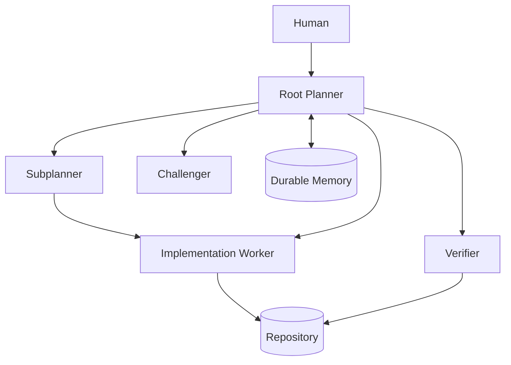
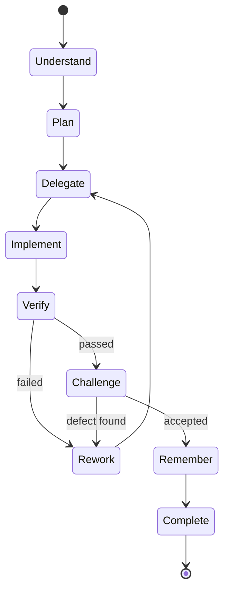
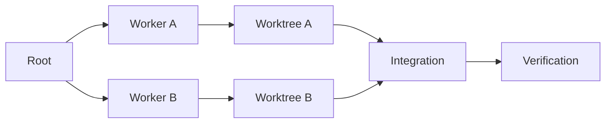

# Architecture

## Capability graph

## Responsibilities

### Root Planner
Owns:
- user intent
- global plan
- delegation
- integration decisions
- final acceptance
- durable memory lifecycle

Does not own:
- routine implementation

### Subplanner
Owns:
- a bounded domain
- local decomposition
- worker instructions
- reporting upward

Does not own:
- final acceptance
- global memory lifecycle
- cross-project authority

### Worker
Owns:
- implementation of one bounded objective
- local checks it is permitted to execute
- concise report of changes/findings

Does not own:
- final completion
- durable global memory
- orchestration policy

### Verifier
Owns:
- authoritative acceptance checks
- repository diff inspection
- tests/build/lint/static analysis as required
- detection of unrelated changes

### Challenger
Owns:
- independent criticism
- requirement-gap detection
- edge-case review
- alternative reasoning

Should not silently mutate the implementation under review.

### Durable Memory
Owns:
- decisions
- stable conventions
- non-obvious discoveries
- reusable lessons
- session summaries

Does not own:
- locks
- worker status
- transient todo state
- runtime scheduling

## Control loop

## Isolation rule

Parallel mutation is safe only when workspaces are isolated.

