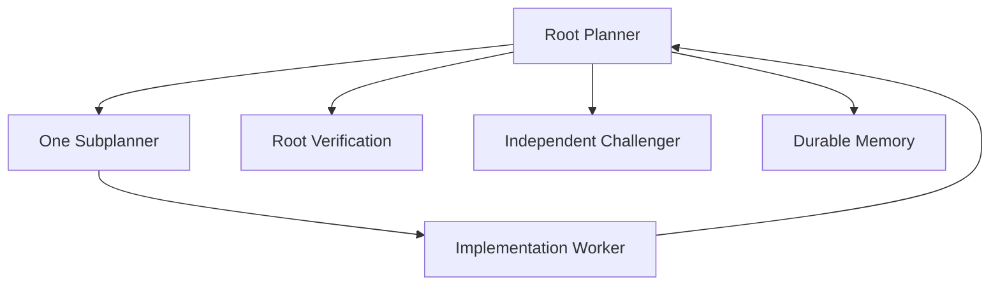

# Eval 001 — Mini End-to-End Architecture Test

## Goal

Exercise the full control loop on a tiny task so failures can be attributed to orchestration rather than task difficulty.

Task:

```text
Add safeDivide(a, b) to src/math.js.
- normal division returns a / b
- b === 0 throws Error("division by zero")
- exactly 3 tests
- no dependencies
- no unrelated changes
```

Required route:



See `result.md` and `memory-result.md`.
